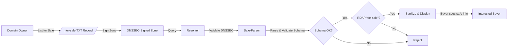
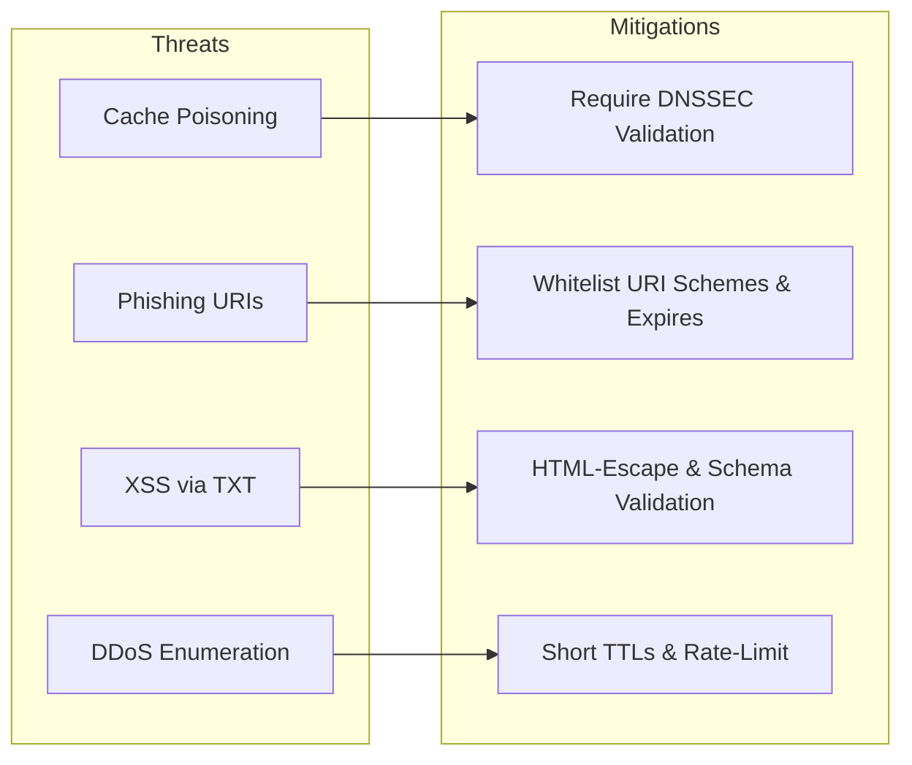

---

## Executive Summary

A proposed IETF draft allows domain owners to advertise “for sale” status by adding an underscored DNS TXT record:

```
_for-sale.example.com. IN TXT "v=FORSALE1;[free-form content]"
```

While easy to deploy, this mechanism opens multiple high-impact security, privacy, and operational risks. Below, we:

1. **Rank** each risk on a 1–5 severity scale (5 = most critical).
2. **Explain** each risk in technical detail.
3. **Prescribe** specific mitigations or alternative approaches.
4. **Present** overall lifecycle and threats-to-mitigations flowcharts.

---

## 1. Severity-Ranked Risk Overview

| Severity | Risk                                           | Description                                                                |
| :------: | ---------------------------------------------- | -------------------------------------------------------------------------- |
|   **5**  | Phishing & Malware Delivery                    | Malicious sale-URIs leading buyers to dangerous sites.                     |
|   **5**  | DNS Cache Poisoning & Spoofing                 | Fake records injected into resolver caches deceiving users.                |
|   **5**  | Denial-of-Service / Enumeration                | High-volume `_for-sale` lookups and large TXT responses enabling DDoS.     |
|   **4**  | Content Injection / XSS                        | Unsanitized TXT content embedded in UIs, allowing client-side attacks.     |
|   **4**  | Amplification via Large TXT Records            | Oversized TXT RRvalues abused as reflection amplifiers in UDP floods.      |
|   **4**  | Operational Mistakes with Underscored Records  | Wildcards or bulk edits inadvertently break DKIM, SRV, etc.                |
|   **3**  | Privacy Leakage                                | Harvesters scrape exposed email/phone URIs for spam or social engineering. |
|   **3**  | Stale or Incorrect Sale Status                 | Buyers misled by expired or withdrawn “for sale” flags.                    |
|   **3**  | Zone Harvests for Targeted Campaigns           | Attackers compile “for-sale” lists for spear-phishing.                     |
|   **3**  | Ambiguity & Abuse Potential                    | Any zone-editor can set or forget the flag; no central verification.       |
|   **2**  | DNSSEC Overhead & Stale TTL Caching            | Frequent re-signing, resolver TTL variances—operational friction.          |
|   **2**  | Dependency on Public Suffix List Accuracy      | PSL omissions limit valid placements—known ecosystem issue.                |
|   **2**  | Limited Deployment Incentive / Partial Signals | Inconsistent adoption dilutes value—market-dynamics issue.                 |
|   **2**  | Cross-Protocol Confusion                       | Parsers misinterpret free-form URIs (`mailto:` vs. `tel:`).                |
|   **1**  | Reinventing Existing RDAP/WHOIS Solutions      | Duplication of existing sale-status mechanisms—policy critique.            |

---

## 2. Detailed Risk Analyses & Mitigations

### Severity 5 – Critical

#### 2.1 Phishing & Malware Delivery

**What could happen?**
A malicious domain owner publishes a sale URI pointing to a phishing site or malware host:

```dns-zone
_for-sale.victim.com. IN TXT "v=FORSALE1;https://phish.example/login"
```

Automated tools or users clicking that “official” link suffer credential theft or drive-by downloads.

**Mitigations:**

1. **Structured, Whitelisted Payloads**

   * Define a strict JSON schema:

     ```json
     {
       "v":"1",
       "price":"USD:1234",
       "url":"https://…",           
       "contact":"mailto:…",         
       "expires":"2025-06-01"        
     }
     ```
   * Reject any payload not exactly conforming.
2. **Content Validation & Escaping**

   * UI layers must HTML-escape all output.
   * URI fields validated against a small whitelist of schemes.
3. **Registrar-Backed Authorization**

   * Only registrars (via EPP) can set or clear the flag.

---

#### 2.2 DNS Cache Poisoning & Spoofing

**What could happen?**
Without DNSSEC, attackers inject fake `_for-sale` records into resolver caches, deceiving large audiences.

**Mitigations:**

1. **Mandatory DNSSEC**

   * Zones publishing `_for-sale` **must** be signed; parsers reject unsigned records.
2. **Short-TTL Window**

   * On flag changes, use TTL ≤ 300 s to limit poison exposure.

---

#### 2.3 Denial-of-Service / Enumeration

**What could happen?**
Mass scans of `_for-sale` across millions of domains, returning large TXT payloads, create DNS amplification DDoS and overload name servers.

**Mitigations:**

1. **Rate-Limiting & Query Controls**

   * Registries throttle repeated `_for-sale` queries per source IP.
2. **TXT Size Cap**

   * Policy: RDATA ≤ 255 bytes; oversized records are dropped.
3. **Optional New RR Type**

   * Introduce a dedicated `SALE` RR so legacy DNS tools don’t inadvertently scan TXT.

---

### Severity 4 – High

#### 2.4 Content Injection / XSS

**What could happen?**
A record such as:

```dns-zone
_for-sale.example.com. IN TXT "v=FORSALE1;<script>alert(1)</script>"
```

If inserted unsafely into HTML, it executes client-side script.

**Mitigations:**

1. **Strict Schema Parsing**

   * Reject any value containing `<` or `>` outside quoted JSON.
2. **HTML-Escape on Display**

   * All UI frameworks must escape dangerous characters.

---

#### 2.5 Amplification via Large TXT Records

**What could happen?**
Operators ignore the 255-byte recommendation and publish multi-kilobyte TXT payloads, fueling UDP amplification floods.

**Mitigations:**

1. **Enforce RDATA ≤ 255 bytes**

   * Zone loaders and policies enforce the cap.
2. **Limit EDNS Response Size**

   * Authoritative servers refuse or truncate responses above 512 bytes.

---

#### 2.6 Operational Mistakes with Underscored Records

**What could happen?**
Wildcard scripts or bulk updates intended for `_for-sale` accidentally override DKIM, SRV, or other `_` records, causing service outages.

**Mitigations:**

1. **Prohibit Wildcards**

   * Registrar policies disable wildcard entries for `_for-sale`.
2. **Registrar/EPP Control**

   * Only allow flag changes through EPP extensions.

---

### Severity 3 – Medium

| Risk                        | Description                                                         | Mitigation                                                                            |
| --------------------------- | ------------------------------------------------------------------- | ------------------------------------------------------------------------------------- |
| Privacy Leakage             | Harvesters scrape exposed URIs for spam or social engineering.      | – Use proxy-email or escrow forms.<br>– Obfuscate contacts in UI.                     |
| Stale/Incorrect Sale Status | Buyers rely on flags persisting after sale completion.              | – Add an `"expires"` field.<br>– Automate removal on transfer via EPP hook.           |
| Zone Harvests for Campaigns | Attackers compile lists of “for-sale” domains for spear-phishing.   | – CAPTCHA or API-key gate mass enumeration.<br>– Blacklist abusive crawlers.          |
| Ambiguity & Abuse Potential | Any zone-editor can set or forget the flag—no central verification. | – Registrar/EPP toggles only.<br>– Cross-check RDAP `for-sale` status before display. |

---

### Severity 2 – Low

| Risk                         | Description                                                 | Mitigation                                                                                |
| ---------------------------- | ----------------------------------------------------------- | ----------------------------------------------------------------------------------------- |
| DNSSEC Overhead & Stale TTL  | Frequent re-signing and resolver TTL variances.             | – Automate DNSSEC on EPP changes.<br>– Publish TTL-honor guidelines.                      |
| Dependency on PSL Accuracy   | Only works under suffixes in the Public Suffix List.        | – Supplement with registrar-maintained metadata.<br>– Offer explicit EPP scope parameter. |
| Limited Deployment Incentive | Partial adoption dilutes reliability.                       | – Provide open-source libraries.<br>– Integrate into registrar dashboards.                |
| Cross-Protocol Confusion     | Parsers misinterpret free-form URIs (`mailto:` vs. `tel:`). | – Enforce explicit field names in schema.<br>– Validate each URI scheme precisely.        |

---

### Severity 1 – Minor

#### 2.7 Reinventing RDAP/WHOIS Duplication

**What could happen?**
This duplicates existing RDAP/WHOIS sale-status attributes rather than leveraging them.

**Mitigation:**
– Extend RDAP with a standardized `"for-sale"` attribute, or mirror RDAP flags in DNS rather than free-form TXT.

---

## 3. Process Flows & Threat Maps

### 3.1 Sale-Record Lifecycle



---

### 3.2 Threats → Mitigations Mapping



---

## 4. Conclusion

The `_for-sale` TXT concept is lightweight and instantly deployable but introduces several critical security, privacy, and operational vulnerabilities. By enforcing:

* **Structured, versioned payloads**
* **Mandatory DNSSEC & registrar/EPP authorization**
* **Short TTLs & size caps**
* **Strict sanitization & schema validation**

we preserve ease of deployment **while** mitigating the gravest risks, resulting in a trusted, automatable domain-sale signaling mechanism.
